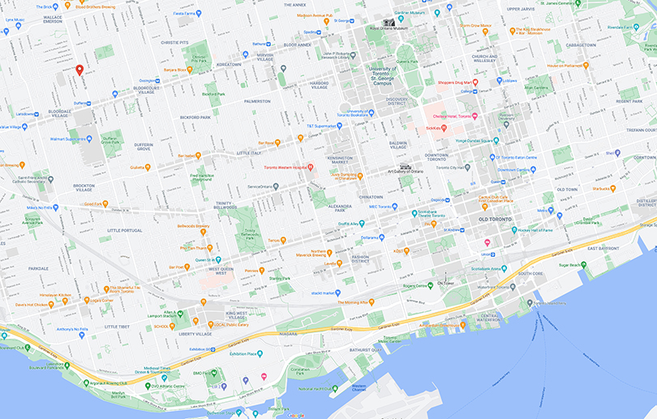

# Toolman
•Course name: Web Computing and Web Systems
•Group name: Toolman
•Member 1: Run Zhang
•Member 2: Boming Jin

Answer for HTML picture and source tag
i). <picture>
        <source media="(min-width:450px)" srcset="images/loconmap.jpg" >
              
    </picture>

The selector will show locomap.jpg at first, and as the screen narrows, the width of the 
image will start to get shorter. When the width is less than 450px, the selector will show 
samlllocomap.jpg which is the small picture.

ii).
Three positive goals:
1.Suppose you use the img tag for high-resolution images. In this case, the same image will 
be applied on every device that has the application running and will affect the performance 
of lower resolution devices (e.g., mobile devices).
2.In most cases, we need to handle resolution switching and artwork at the same time, then the 
picture tag is the best choice.
3.Img tags result in longer image loading times and top-to-bottom image loading piece by piece.

iii).
The advantage of the Img tag is that usually the browser can leave the appropriate height and 
width space before the image is loaded, which in some cases is beneficial for layout.